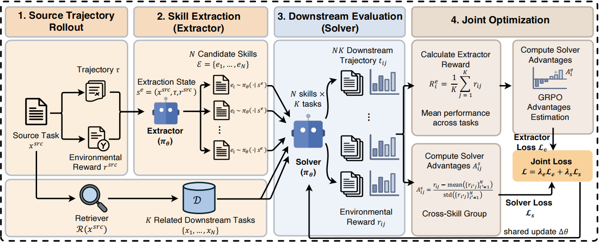

# Evolving-RL: End-to-End Optimization of Experience-Driven Self-Evolving Capability within Agents [[Paper]](https://arxiv.org/abs/2605.10663)

## Overview

<p align="center">

</p>

**Evolving-RL** is a reinforcement learning framework that jointly optimizes the experience extraction and utilization capabilities of LLM agents within a unified training paradigm. For each source interaction, the shared policy generates candidate textual skills, evaluates them on retrieved downstream tasks, and uses the resulting feedback to co-train both the extractor and the solver via GRPO, enabling their co-evolution.

## Pipeline

Each training rollout follows a four-stage pipeline:

```
Source Episode (Solver, no skill)
        |
        v
Skill Extraction (Extractor)  -->  N candidate structured JSON skills
        |
        v
Dense Retrieval  -->  Top-K semantically similar downstream tasks
        |
        v
Downstream Evaluation (Solver, with skill)  -->  Rewards for both Extractor and Solver
```

1. **Source Episode**: The Solver interacts with the environment without any injected skill, producing a full trajectory.
2. **Skill Extraction**: The Extractor distills the trajectory into N candidate skills -- structured textual abstractions encoding workflow steps, decision rules, error handling, and applicability conditions.
3. **Dense Retrieval**: A retrieval server (backed by Qwen3-Embedding-4B) finds K semantically similar tasks from the training set.
4. **Downstream Evaluation**: Each candidate skill is evaluated by running the Solver on all retrieved tasks. Aggregated downstream rewards optimize the Extractor; skill-conditioned trajectories are reused to optimize the Solver.

Both Extractor and Solver share the same policy parameters and are jointly optimized with GRPO, enabling their co-evolution.

## Project Structure

```
Evolving-RL/
|-- configs/        # YAML configuration files (environment, training, evaluation)
|-- src/            # Core source code
|   |-- alfworld/   # ALFWorld pipeline (rollout, eval, extractor, reward, prompts)
|   |-- web/        # Mind2Web pipeline (parallel structure to alfworld/)
|   |-- utils/      # Shared utilities (skill language audit)
|   |-- data/       # Data preparation scripts
|-- env/            # Environment and retrieval servers
|   |-- alfworld/   # ALFWorld router + worker servers, retrieval server
|   |-- web/        # Mind2Web environment server, retrieval server
|-- scripts/        # Shell scripts for data preparation and training
|-- slime/          # RL training framework (Megatron-LM + SGLang + Ray)
|-- data/           # Data directory (auto-populated by prep scripts)
|-- models/         # Model checkpoints (base + trained)
```

## Getting Started

### Installation

Please follow the official [slime](https://github.com/THUDM/slime) repository for environment setup and installation. We recommend using the official Docker image.

### Model Preparation

```bash
git clone https://github.com/Fanzy27/Evolving-RL.git
cd Evolving-RL

# Download base model
huggingface-cli download Qwen/Qwen2.5-7B-Instruct --local-dir models/Qwen2.5-7B-Instruct

# Convert to Megatron-format reference model (for KL regularization)
source slime/scripts/models/qwen2.5-7B.sh
cd slime
PYTHONPATH=/root/Megatron-LM python slime/tools/convert_hf_to_torch_dist.py \
    ${MODEL_ARGS[@]} \
    --hf-checkpoint models/Qwen2.5-7B-Instruct \
    --save models/Qwen2.5-7B-Instruct_torch_dist
cd ..
```

### Environment Setup and Data Preparation

**ALFWorld:**
```bash
pip install alfworld
pip install gymnasium==0.29.1
pip install stable-baselines3==2.6.0
pip install flask

export ALFWORLD_DATA=data/alfworld/task_files
alfworld-download -f

bash scripts/alfworld/prepare_data.sh
bash scripts/alfworld/build_cache.sh
```

**Mind2Web:**
```bash
pip install ijson
bash scripts/web/prepare_data.sh
bash scripts/web/build_cache.sh
```

## Training

### ALFWorld

```bash
bash scripts/alfworld/train_alfworld.sh
```

### Mind2Web

```bash
bash scripts/web/train_web.sh
```

## Citation

If you find our work helpful, please consider citing:

```bibtex
@misc{fan2026evolvingrlendtoendoptimizationexperiencedriven,
      title={Evolving-RL: End-to-End Optimization of Experience-Driven Self-Evolving Capability within Agents}, 
      author={Zhiyuan Fan and Wenwei Jin and Feng Zhang and Bin Li and Yihong Dong and Yao Hu and Jiawei Li},
      year={2026},
      eprint={2605.10663},
      archivePrefix={arXiv},
      primaryClass={cs.AI},
      url={https://arxiv.org/abs/2605.10663}, 
}
```

## Acknowledgement

This project builds upon the following open-source projects:
[slime](https://github.com/THUDM/slime),
[Qwen](https://github.com/QwenLM/Qwen),
[ALFWorld](https://github.com/alfworld/alfworld),
[Mind2Web](https://github.com/OSU-NLP-Group/Mind2Web).
